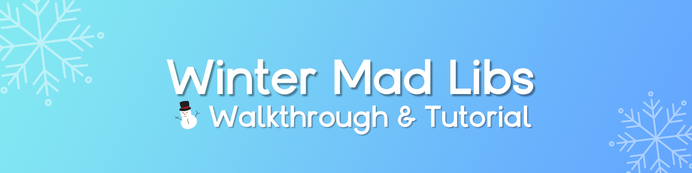

# ❄️ Winter Mad Libs
This is the repo for **Winter Mad Libs** app tutorial from my YouTube channel.

## Getting Started
1. Clone the repo, the navigate to `src/`.
2. Open `madlibs.html` in the browser of your choice.

## Where to Go From Here
❄️ Check out a **live demo** of Winter Mad Libs [here](https://breehall.github.io/MadLibs/src/madlibs.html)

📓 Find the written project insturctions here

📷 Watch the full tutorial on my YouTube channel

## What's Mad Libs? 
Mad Libs are stories with words removed and replaced by blank spaces. Each player fills in the blanks for a fun story! Make sure to think outside the box. The wackier, the better!

**This project was built using:**

